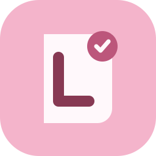
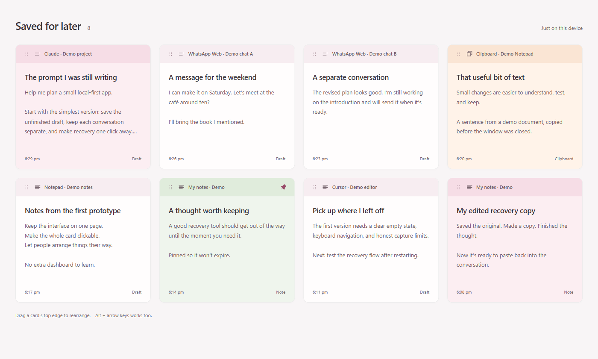
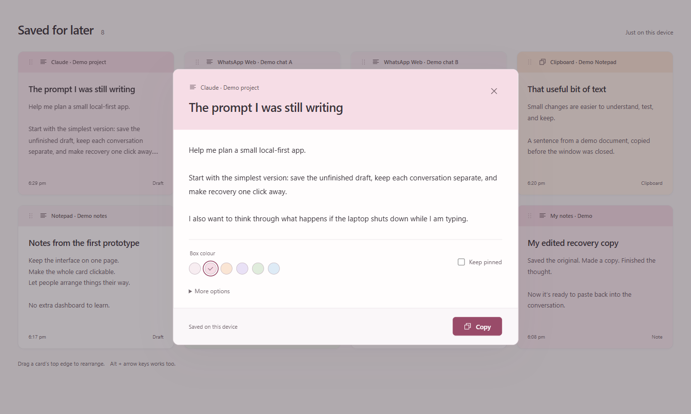

<div align="center">



# Lossy

### Keep the thought. Even when the window is gone.

A local draft-recovery and clipboard app for Windows.
Save supported unfinished text, keep conversations separate, and pick up where you left off.

[**Download for Windows**](https://github.com/imthegoodboy/lossy/releases/latest) · [Getting started](docs/user-guide.md) · [Browser companion](docs/browser-companion.md)


[](https://github.com/imthegoodboy/lossy/actions/workflows/ci.yml)

</div>



*Actual interface with invented demo data. No private conversations are shown. Browser examples require the companion; editor support varies.*

## The problem

You spend ten minutes writing a prompt. The app crashes, the laptop loses power, or you close
the wrong window. The text was never sent, and copying your previous clipboard does not bring it back.

Or you switch between two conversations and want each unfinished message kept on its own.
One giant typing log would be almost as frustrating as losing the text.

**Lossy keeps recoverable snapshots of supported text as you work, organised into separate cards.**
It also remembers copied text and bitmap images from allowed apps. When you need something back,
open the card, copy it, and continue.

> [!IMPORTANT]
> Lossy is a recovery aid, not a promise of zero loss. It can recover only text it observed and
> committed before the interruption. Some apps do not expose their text or conversation identity.
> Password/private/protected fields are skipped; there is no raw keylogging fallback.

## A small app, with the useful things

- **Unfinished text, kept locally.** Supported drafts are checkpointed while you type, without waiting for Send.
- **Separate conversations.** App, window, editor and browser context help keep unrelated drafts apart.
  When identity is uncertain, Lossy favours extra cards over mixing conversations.
- **A clipboard you can return to.** Keep copied text and PNG bitmap images from allowed desktop apps.
- **One calm page.** Four cards across on desktop, fewer in smaller windows. Click a card to read the full item.
- **Arrange it your way.** Drag a card's top strip, choose a colour, or pin something worth keeping.
  Your arrangement and colours survive reopening.
- **Recover without overwriting the original.** Copy a saved version or edit a recovery copy.
  Retained revision history is available under More options.
- **Quiet startup.** After you enable capture, Lossy starts in the tray at Windows sign-in, without opening the archive.

## Open it. Copy it. Carry on.



Click anywhere on a card to open it. **Copy** restores the displayed saved text or image to the
clipboard. **More options** contains editing, revision history and deletion. Captured originals
stay intact when you save an edited recovery copy.

Drag the top edge of a card to rearrange the grid. Keyboard users can focus a card and use
**Alt + arrow keys** to move it, **Enter** to open it, and **Escape** to close the popup.
Popup edits require explicit saving; closing with unsaved edits asks for confirmation.

## Install in a few minutes

1. Download `Lossy_0.1.0_x64-setup.exe` from the [latest release](https://github.com/imthegoodboy/lossy/releases/latest).
2. Run the installer and open **Lossy** from the Start menu. Installation is per-user.
3. Read and accept the inline capture permission. This enables supported capture and quiet sign-in startup.
4. Try a harmless sentence in **Notepad**, then open Lossy and check that it appears.
5. For websites, follow the [Chrome/Edge companion setup](docs/browser-companion.md) and enable only the sites you choose.

Closing the archive leaves the tray agent running. Right-click the tray icon to pause saving,
open Lossy, set up the browser companion, or quit. Capture does not start before you give permission.

> [!NOTE]
> This first release is unsigned. Windows may show an unknown-publisher or SmartScreen warning.
> Download only from this repository's releases, and compare the installer's SHA-256 with
> `SHA256SUMS.txt` if you want to verify the download. A checksum verifies the file, not publisher identity.

Requirements: **Windows 10/11 x64** and **Microsoft Edge WebView2**. The installer can obtain
WebView2 if it is missing; that setup step may require internet access. Lossy's capture and archive run locally.

## What can it save?

| Source | Current support |
| --- | --- |
| Notepad and accessible desktop Edit fields | Native capture from an explicit app allowlist |
| Standard Chrome/Edge text boxes | Per-site opt-in through the unpacked browser companion |
| WhatsApp Web drafts | Best-effort isolation; a return to a chat may make a new card when stable identity is unavailable |
| Cursor / VS Code | Depends on accessible editable fields; not every panel is supported |
| Copied desktop text and images | Allowed apps only; PNG bitmap recovery, including supported Paint / Snipping Tool copies |
| Password fields, private browser windows, known password managers | Excluded |
| WhatsApp Desktop, terminals, elevated or inaccessible editors | Not reliably supported |

Lossy does **not** scrape message history, capture browser clipboard images, or guarantee
that every application exposes its drafts. See the [compatibility and recovery guide](docs/user-guide.md)
before relying on it for important work.

## Your words stay on your device

No Lossy account. No cloud sync. No analytics. No raw global keystroke collection.

Content, headings, source labels and preferences are encrypted with **AES-GCM** before storage.
**Windows DPAPI** protects the installation key for your Windows account. The database lives at
`%LOCALAPPDATA%\Lossy\lossy.db`; timestamps, item kind, sizes and pin state remain visible metadata.

The agent uses SQLite **WAL + synchronous FULL** for committed recovery checkpoints, with
retention and three rotating verified backups. Unpinned items default to 30-day retention;
pinned items do not expire. Deleting an item does not immediately remove copies in older backups.

Encryption does not protect against malware running as your Windows user. Ordinary prompts can
still contain sensitive information: enable capture selectively and pause it when appropriate.
Backups remain tied to your account's DPAPI keys; they are not independently portable to another PC.

[Security policy](SECURITY.md) · [Storage guarantees](docs/storage.md) · [Restore instructions](docs/user-guide.md#privacy-retention-and-recovery)

## Under the hood

A **Tauri + React** archive talks to a separate **Rust** background agent over a current-user
named pipe. The agent owns capture and persistence, so closing the UI does not stop saving.
Native UI Automation, clipboard observation and the browser companion feed context-aware
snapshots into the encrypted store.

Native editors are sampled at about 35 ms and the clipboard at 100 ms. Browser input events
forward immediately, with a 200 ms fallback for programmatic clearing. These are observation
intervals, not end-to-end latency or physical-power-loss guarantees.

[Runtime architecture](docs/implementation.md) · [Original design plan](plan.md) · [Browser protocol and setup](docs/browser-companion.md)

## Build from source

Use Windows 10/11 x64, Rust 1.88+, Node.js 22+, WebView2 and the Windows MSVC build tools.

```powershell
cd apps/desktop
npm ci
npm run build
cd ../..
cargo fmt --all -- --check
cargo clippy --workspace --all-targets --locked -j 1 -- -D warnings
cargo test --workspace --locked -j 1
cd apps/desktop
npm run tauri -- build
```

The installer is written to `target/release/bundle/nsis/`. For local development, run
`npm run tauri -- dev` from `apps/desktop`. On low-memory machines, set `CARGO_BUILD_JOBS=1`
before packaging.

The test suite covers context separation, stale events, encrypted storage, interrupted writes,
revision conflicts, IPC framing, and persisted card arrangements. An additional installed-app
smoke test exercises native capture, clipboard images and process-restart recovery with synthetic data:

```powershell
# Quit Lossy first. This test temporarily uses synthetic clipboard content.
./scripts/smoke-installed.ps1 -Interactive
```

## Help shape Lossy

Found a missing draft or an unsupported editor? Open an [issue](https://github.com/imthegoodboy/lossy/issues)
with the app version and a **synthetic** reproduction, not your real conversation or database.
See [CONTRIBUTING.md](CONTRIBUTING.md) for the development workflow.

Further work includes signed distribution, more app-specific adapters, large-archive performance
hardening and physical power-loss testing. These are not presented as already solved.
